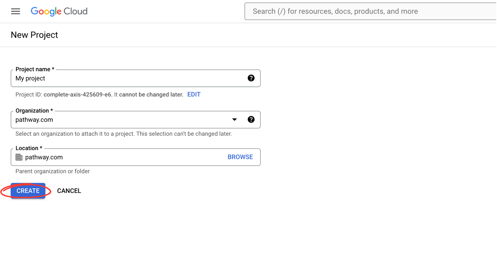
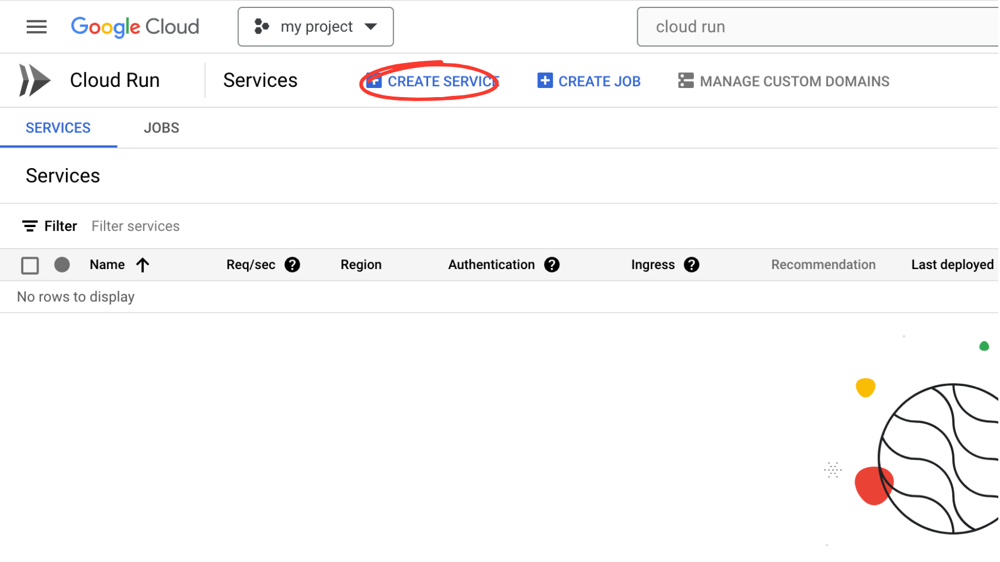
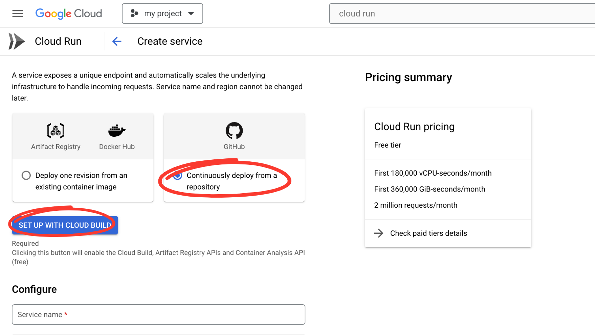
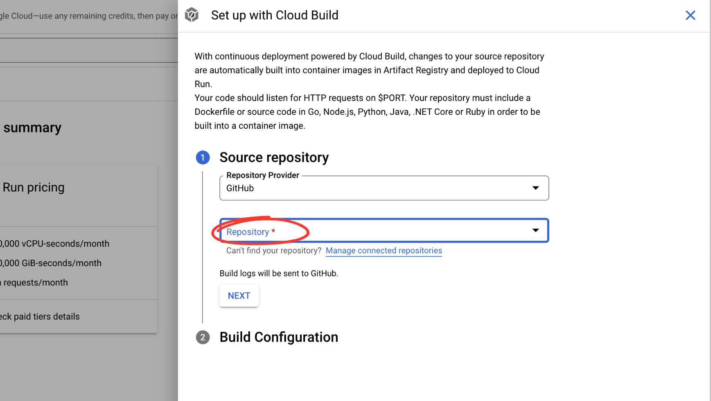
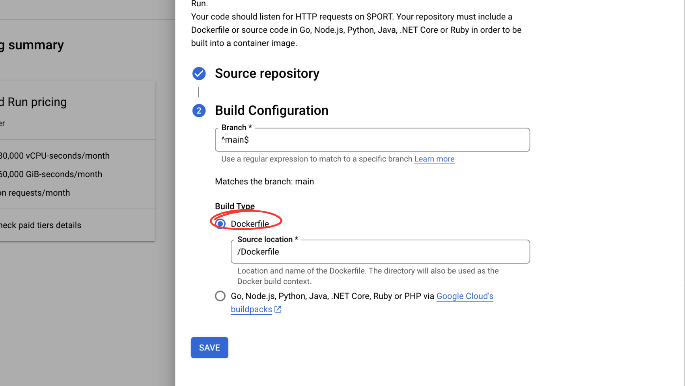
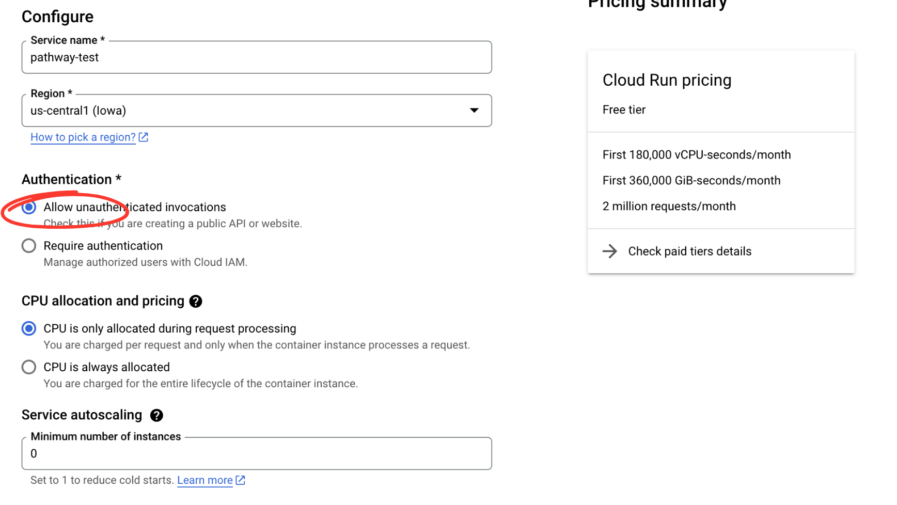
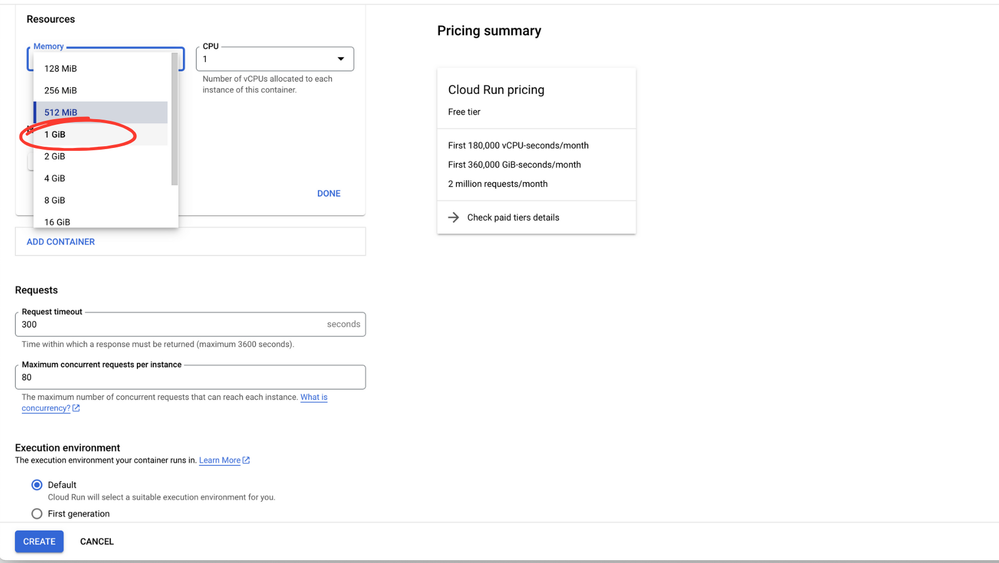
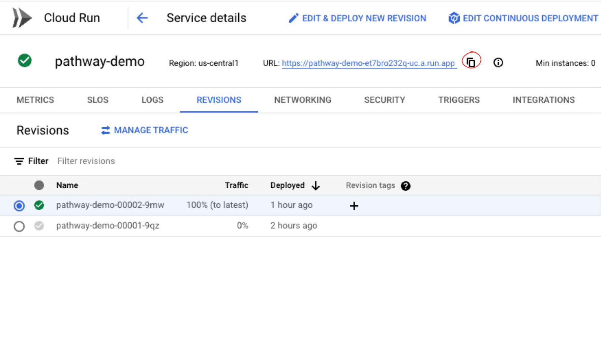
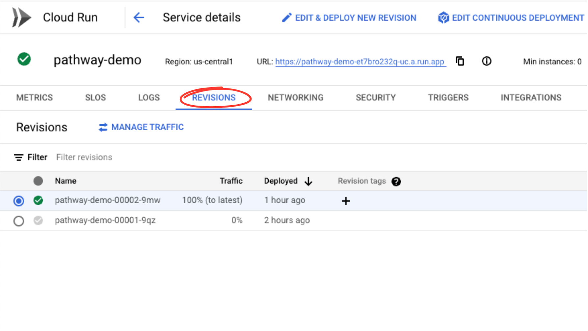
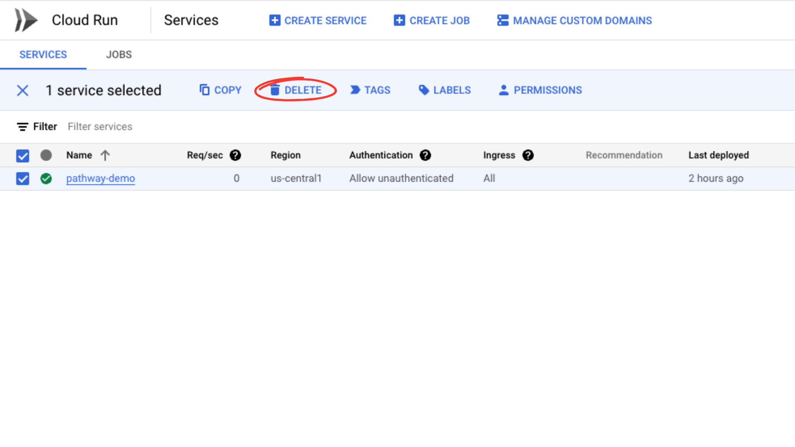

# Dockerized Pathway Webservice

This repository provides a simple Pathway Webservice and Dockerfile.  
The provided guidelines showcase how to deploy this application on GCP using Google Cloud Run, but it can be deployed on any platform supporting containers.   
Check out our [deployment tutorials](https://pathway.com/developers/user-guide/deployment/cloud-deployment) to learn more.

# Deploy to Google Cloud Platform using Cloud Run

Google Cloud Platform (GCP) is a suite of cloud computing services from Google, providing a comprehensive infrastructure to deploy and manage applications of all kinds. 
You will learn how to deploy your Pathway application to GCP using Cloud Run, a compute platform that lets you run containers on scalable infrastructue. 

The entire process is as easy as deploying any dockerized application.

## Prerequisites:

1. Google account
2. GitHub account
3. Fork of this repository

Regardless of whether you use a Gmail or Google Workspace account, you can test Cloud Run for free. 
Google may require billing information, but you will not be charged after the trial period.

## Create Google Cloud project
The first step is to create a Google Cloud project at [GCP Console](https://console.cloud.google.com/projectcreate)

1. Choose friendly name of your project and click `Create`




## Create Cloud Run service
Now that you have your project ready, go to [Cloud Run](https://console.cloud.google.com/run).
Make sure your newly created project is selected in top left corner.

1. Click on the "Create Service" button




2. Select "Continuously deploy from a repository" and click on "Set up with Cloud Build":




2. Point to the repository with the fork of the demo project and click "Next" button:

Note: Google may prompt you to enable additional APIs. In such case simply click **Enable** and wait for a short time.
If you are not authenticated already, choose **Github** as the repository provider and authenticate.




3. Choose "Dockerfile" as a build type and save the changes:




Note: if you are using custom repository, you can adjust Dockerfile path.

4. Select "Allow unauthenticated invocations" as an authentication type:




5. Under container resources section, increase memory to at least 1 GiB and click "Create":




## Test your deployment
Once your app has been deployed, you will see a green mark next to the project name.
You can now copy the URL of your service and test it with CURL.




```bash
curl -X POST -d '{"input": "hello, world"}' <YOUR-URL>
```

You can learn more about this example on [GitHub](https://example.com).

## Deploy changes

You have successfully deployed a sample Pathway application using Cloud Run. You can now adjust the Pathway pipeline by modifying app.py. 
Once you are ready, commit and push your changes. Cloud Build will automatically detect your changes and start deploying the new version. 
You can monitor this process under the revisions tab.




## Delete your web service

If you were only testing your web service and wish to delete it, go to [Cloud Run](https://console.cloud.google.com/run), select your service, and click the "Delete" button.  


